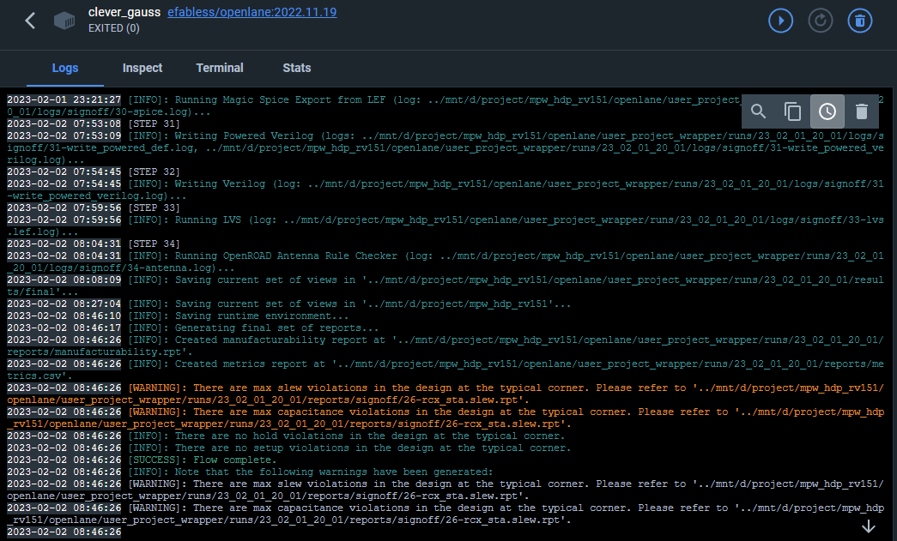
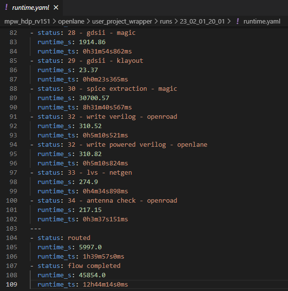
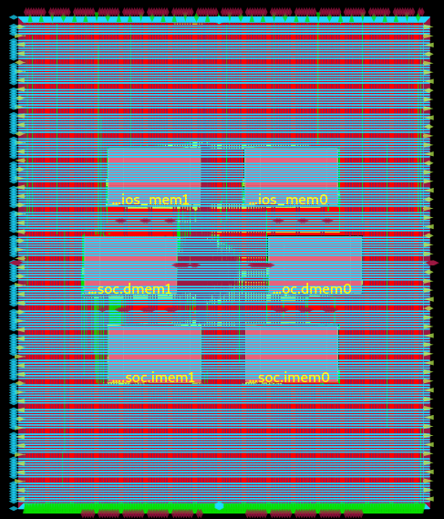
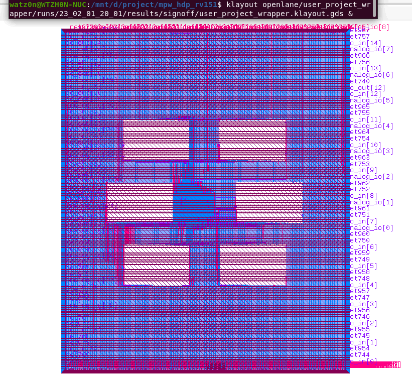
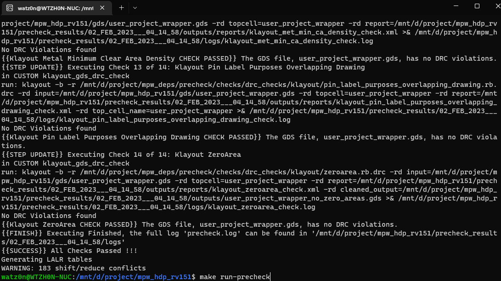
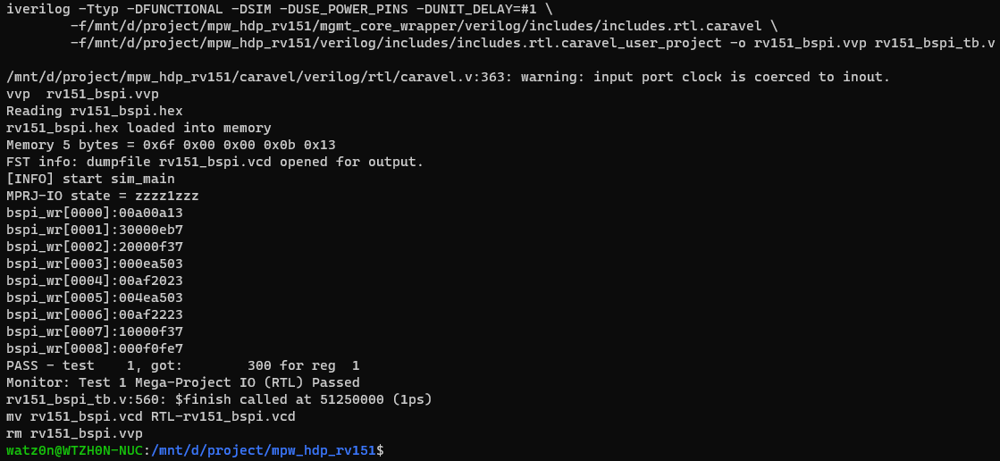
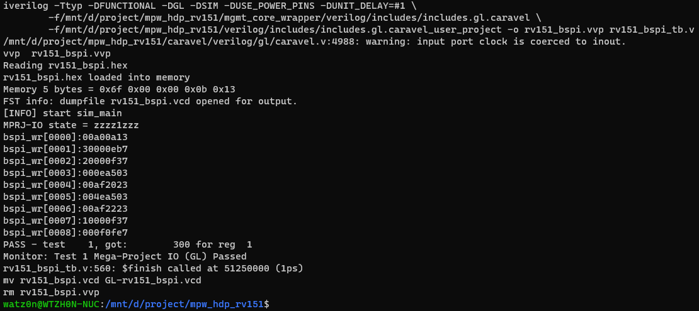

# MPW-Precheck on HDP-RV151 Project

* Goal: Generate HDP-RV151 Project GDS from Physical Implementation Flow by OpenLane, then pass MPW-Precheck validations.
* Project Information: [VSD-HDP Walkthrough](https://github.com/watz0n/vsd-hdp)
* Author: Watson Huang (wats0n.edx@gmail.com)

------
### Usage Guide

1. Set-up Environment
    ```
    $ source env_setup.sh
    ```
2. Perform RTL-to-GDS flow
    ```
    $ make user_project_wrapper
    ```
3. MPW-Precheck
    ```
    $ make run-precheck
    ```
4. Behavior/Gate-Level RTL Simulation
    ```
    // Behavior
    $ make verify-rv151_bspi-rtl
    // Gate-Level
    $ make verify-rv151_bspi-gl
    ```

------
### Results

1. RTL-to-GDS Flow
    
    * [1] MPW OpenLane Flow Logs<br />
    
    * [2] OpenLane Elasped Time, total >12hrs, critical: Magic SPICE Extraction(8hrs)<br />
    
    * [3] Post-Routing Layout in OpenRoad-GUI<br />
    
    * [4] Sign-Off Layout in Klayout<br />
    
    * [5] Pass MPW-Precheck, include Magic/Klayout DRC-Checks<br />
    

2. RTL Simulation

    * [1] RTL Behavior Simulation<br />
    
    * [2] RTL Gate-Level Simulation<br />
    

------
### Work-Around

1. Magic DRC translate to other exchangeable form issue
    * Disable `RUN_MAGIC_DRC` in `openlane\user_project_wrapper\config.json`
    ```
        "RUN_MAGIC_DRC": false,
    ```
    * Check the DRC-Rules in MPW-Precheck flow

------
### Reference
    
* [1]. Sky130 SRAM Macro DRC work-around discussion
    * [efabless/mpw_precheck: Precheck crash with SRAM DRC](https://github.com/efabless/mpw_precheck/issues/180)

------